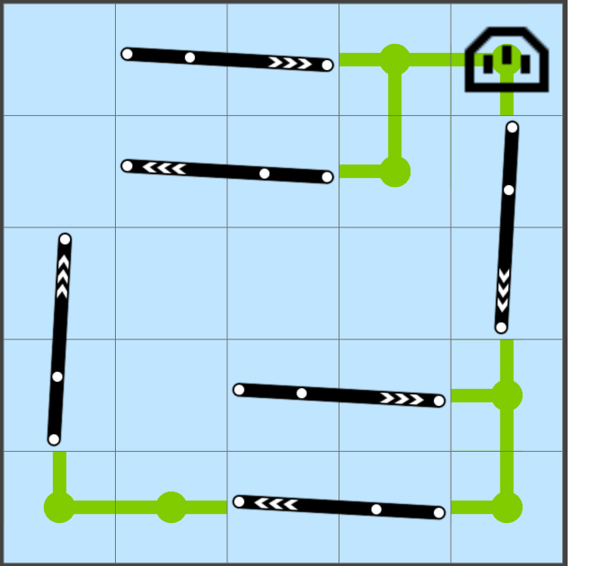
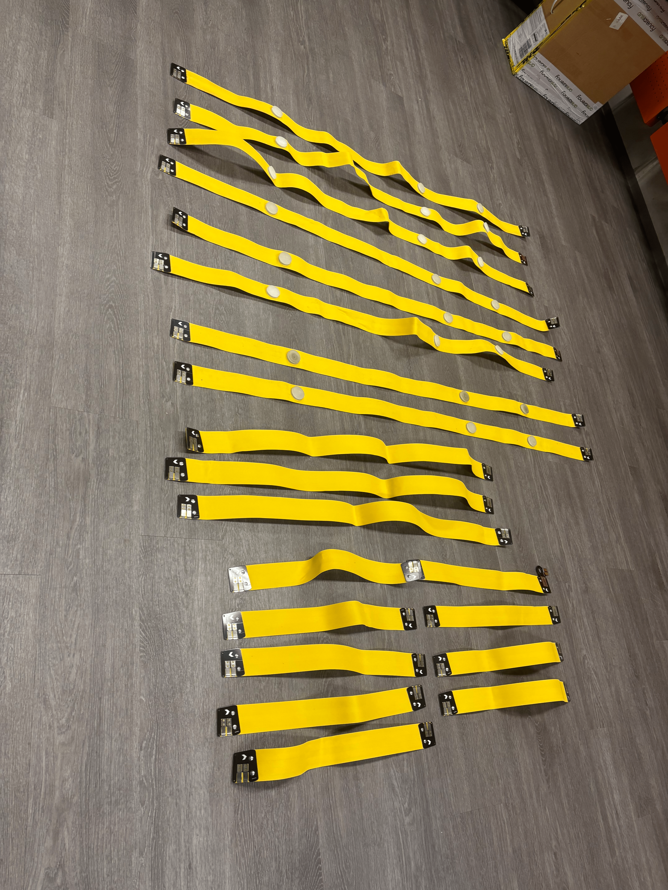
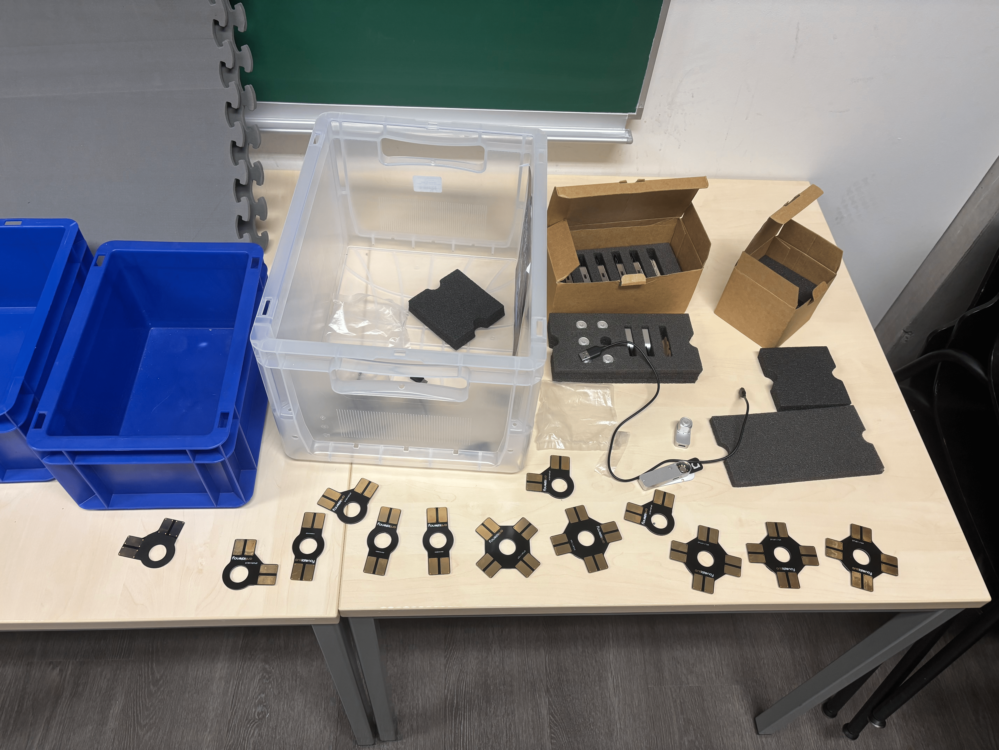
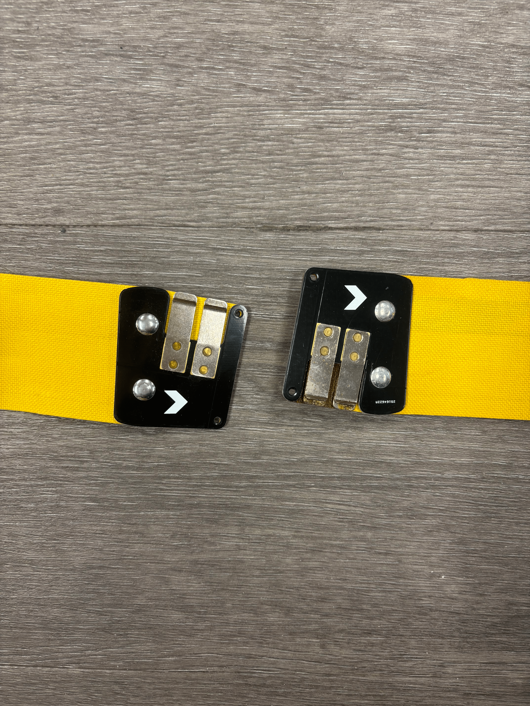
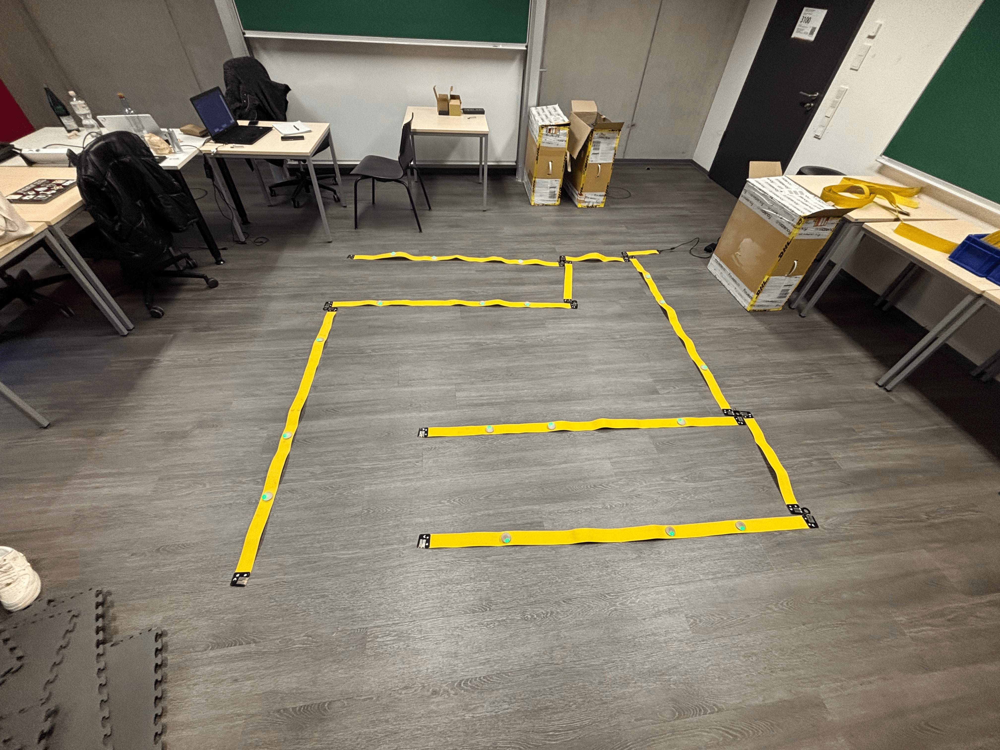
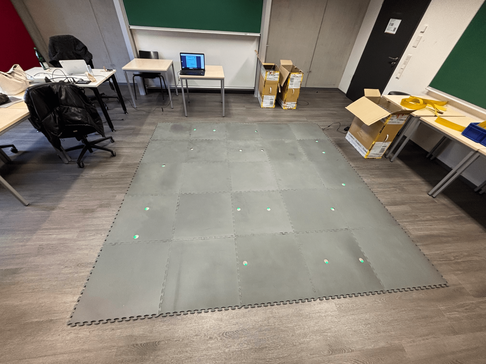
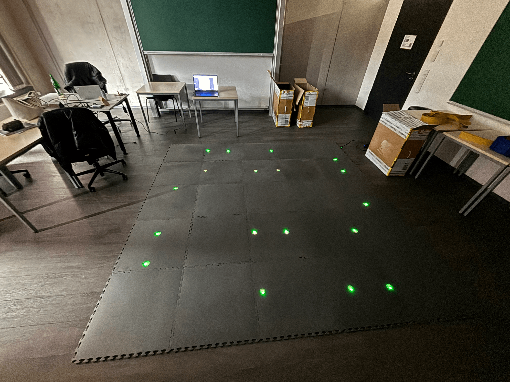
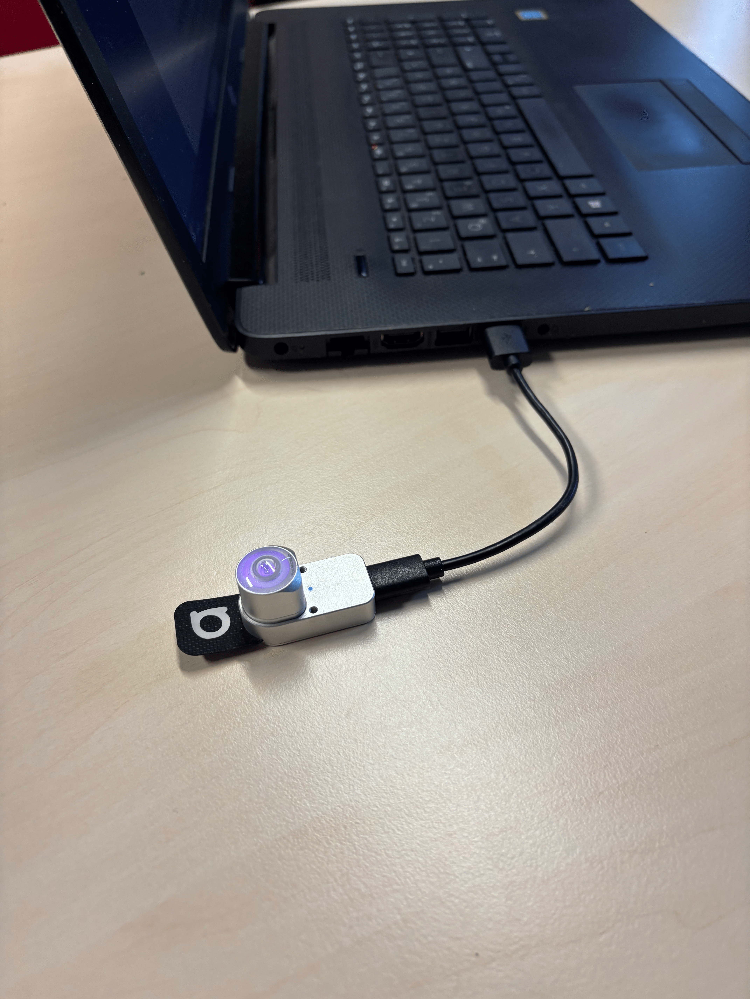
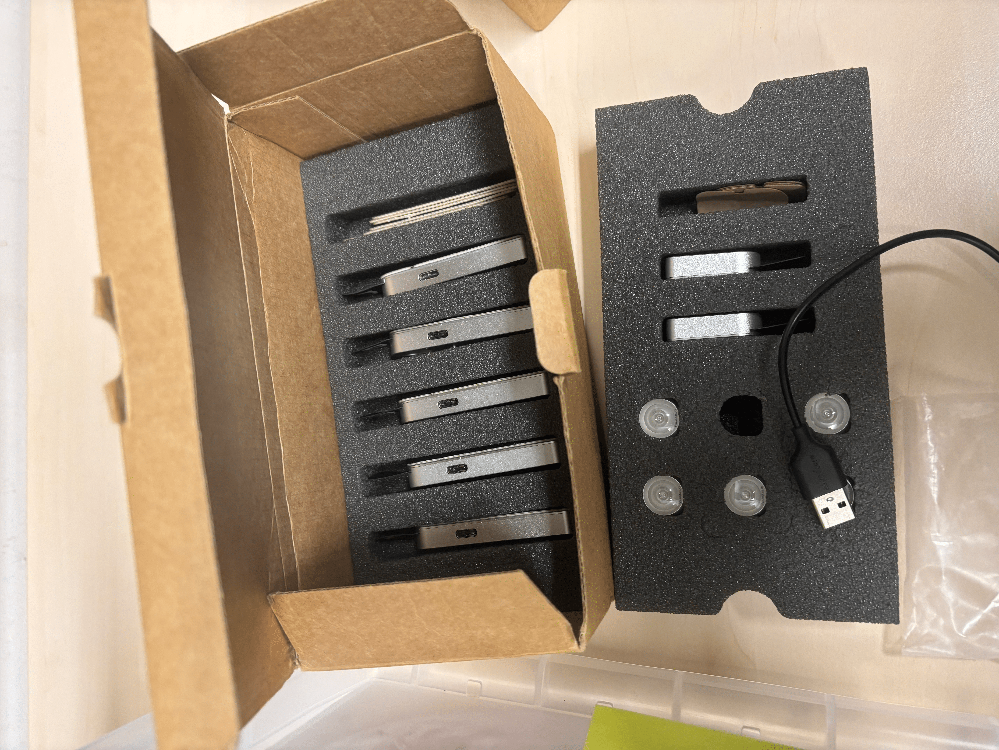
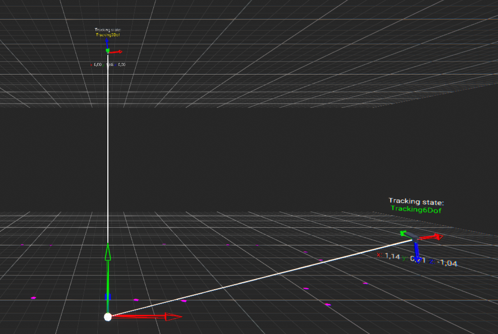

# Antilatency – Setup und wichtige Informationen

Die Anleitung für ein allgemeines Setup findet man unter folgendem Link:  
[Quickstart](https://developers.antilatency.com/HowTo/QuickStart_en.html)

In diesem Dokument finden Sie eine konkrete Zusammenfassung der Schritte für unser System.

---

## Schritt 1 – Software

Grundlage der Installation ist die Antilatency-Software namens **Antilatency Service** in der Version **4.5.0 für Windows**.  
Nach der Installation kann man anfangen, mit dem Programm zu arbeiten.

---

## Schritt 2 – Environment

Als Nächstes sollte in der Software ein Grundriss der eigenen Tracking-Fläche erstellt werden.  
Dabei wählt man zunächst aus, ob die Fläche **am Boden** oder **an der Decke** kalibriert werden soll.

Es stehen bereits **Default-Setups** für Standardbodenflächen (in unserem Fall **3×3 m**) zur Verfügung.  
Die Tracking-Qualität hängt davon ab, wie viele Kabel mit Sensoren verwendet werden.

---

## Schritt 3 – Aufbau der Tracking-Fläche

In diesem Schritt nutzt man die erstellte Vorlage des Environments, um die Tracking-Fläche exakt nach diesem Schema aufzubauen.  
Es stehen Kabel in verschiedenen Längen zur Verfügung, um das Layout zu realisieren.

Für das Verbinden der Kabel gibt es **Konnektoren** in verschiedenen Ausrichtungen (*I*, *L*, *X*).

 

Idealerweise beginnt man damit, den **Stromanschluss** mit den ersten Kabeln zu verbinden und folgt dann dem Schema Schritt für Schritt.  

Sind die Kabel korrekt miteinander verbunden, können die **Bodenplatten** entsprechend dem Schema aufgelegt werden.  
Diese enthalten Öffnungen für die Infrarot-Sensoren der Kabel.

---

## Schritt 4 – Konfiguration der Tracker

Folgende Komponenten sind relevant:

1. **Host** – Der PC mit der Software  
2. **Radio Socket** – Access Point, der Signale der Tracker empfängt und an den Host sendet  
3. **Tracker** – 1 bis n, kommunizieren mit dem Radio Socket

 

Das System kommuniziert über **Radio-Channels** mit verschiedenen Frequenzen.  
Es existieren insgesamt **141 Channels**.

Um den Channel mit der besten Übertragungseffizienz zu finden, scannt man die Umgebung mithilfe des **Antilatency Radio Protocols** im jeweiligen Raum der Installation.

.png)

### Wichtige Hinweise

- **ConLimit** = Anzahl der Clients (Tracker), die verwendet werden sollen  
- **Radio Channel** = Auswahl durch Scannen der Umgebungsfrequenzen mit der Antilatency Radio Protocol Software  
- **MasterSN Property** = Die MasterSN Property der Tracker muss der `sys/HardwareSerialNumber` des Hosts entsprechen

---

## Schritt 5 – Demo

Die Funktionalität kann mithilfe der **Demo App** getestet werden.  
Es wird empfohlen, die Version der Demo App zu verwenden, die zur installierten Antilatency Software passt.

Leider existiert die Demo App nur bis Version **4.1.0**, was zu fehlerhaften Ergebnissen führen kann.

---

## Schritt 6 – Integration der Antilatency SDK in Unity

Ab diesem Punkt ist die Installation bereit für den Betrieb und die SDK kann in ein Unity-Projekt eingebunden werden.  
Auch hier muss die **Version der SDK** mit der Version der installierten Antilatency Software übereinstimmen.
