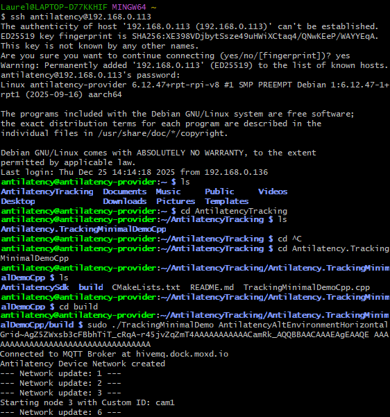

# Schritt 3 – Webclient & Anwendungslogik (Node.js + Browser)

Dieser Abschnitt beschreibt, wie der Webclient (Browser) und die serverseitige Bridge (Node.js) gestartet und betrieben werden.
Außerdem erklärt es, welche Code-Dateien welche Systemfunktion implementieren.

Voraussetzung: Schritt 1 (Pi-Setup) und Schritt 2 (Tracking-Fläche) sind abgeschlossen.

---

## 1. Systemübersicht (Datenfluss)

1. **Raspberry Pi (Tracking-Gateway)**  
   - liest Antilatency Tracking aus
   - published JSON per MQTT auf `antilatency/tracker/<trackerId>`

2. **MQTT Broker**  
   - Transport-Schicht zwischen Tracking-Gateway und Web-Anwendung

3. **Node.js Server (`server.js`)**  
   - subscribed `antilatency/tracker/#`
   - leitet eingehende MQTT Payloads per Socket.IO an alle Browser weiter
   - hostet den Webclient (index.html + JS + CSS)

4. **Browser (Webclient)**  
   - empfängt Tracking-Daten per Socket.IO
   - visualisiert Tracker in einer 3D Szene (Three.js)
   - wendet Interaktionslogik an (Zonen/Mapping → Content/Bildwechsel)

---

## 2. Server Betrieb

Der Node.js Server kann an zwei Orten betrieben werden:

### Option A: Server läuft auf dem Raspberry Pi
- Vorteil: Ein Gerät, einfacher Aufbau
- Zugriff im Browser: `http://<PI-IP>:3000`

### Option B: Server läuft auf einem separaten Rechner (unsere Version)
- Vorteil: mehr Leistung / bessere Wartbarkeit
- Zugriff im Browser: `http://<SERVER-IP>:3000`
- Voraussetzung: Server kann den MQTT Broker erreichen

Wichtig: Der Node.js Server muss im selben Netzwerk (oder über VPN) so angebunden sein,
dass er den MQTT-Broker zuverlässig erreicht.

---

## 3. Mit SSH das Tracking über den Pi starten

**SSH wird benötigt um:**
- den Tracking-Prozess (Pi) zu starten/stoppen (Schritt 1)
- optional den Node.js Server auf dem Pi zu starten
- Logs zu prüfen (MQTT / Tracking / Server)

**SSH Verbindung herstellen:**
1. SSH ssh antilatency@192.168.0.113 -> IP des Pi's
2. PW eingeben
3. Ins Working directory wechseln:
   - `~/AntilatencyTracking/Antilatency.TrackingMinimalDemoCpp/build`
4. Script launchen:
   - `sudo ./TrackingMinimalDemo AntilatencyAltEnvironmentHorizontalGrid~GRIDHASH`

---

## 4. Node.js Server starten (Bridge + Hosting)

### Aufgaben des Servers
- MQTT subscribe (`antilatency/tracker/#`)
- Weiterleitung an Browser per Socket.IO Event `tracking_data`
- Hosting der Webdateien (index.html, JS, CSS)
- Bereitstellung von `/assets` (Mapping-Datei & Medien)

### Code-Datei
- `server.js`

### Wichtige Konfigurationswerte
- `MQTT_HOST` – Broker-Adresse
- `WEB_PORT` – Standard: 3000
- `MQTT_TOPIC` – Standard: `antilatency/tracker/#`

### Assets-Ordner
Damit das System funktioniert, muss es im Repo einen `assets` Ordner geben,
der mindestens enthält:
- `mapping.json`
- Bilddaten / Medien, auf die `mapping.json` verweist (über `baseUrl` + `src`)

---

## 5. Webclient starten (Browser)

### Ablauf im Frontend
1. `main.js` lädt Mapping (`loadMapping()` aus `mapping.js`)
2. `threeScene.js` initialisiert die 3D Szene + Renderloop
3. `tracking.js` verbindet Socket.IO (`io()`) und verarbeitet Tracking-Daten
4. `interaction.js` entscheidet anhand der Tracker-Position, welches Bild angezeigt wird

---

## 6. Anwendungslogik: Was passiert bei Tracking-Daten?

### Tracking-Daten kommen als JSON
Der Browser erwartet JSON im Format:
- `id`
- `pose.position.x/y/z`
- `pose.rotation.x/y/z/w`

Diese Struktur wird vom Raspberry Pi Code geliefert.

### Multi-Tracker / Multi-User Verhalten
- In `tracking.js` wird pro `id` ein eigener Tracker angelegt
- Jede neue ID erzeugt:
  - ein 3D Objekt in der Szene
  - eine UI-Zeile in der Liste
- Tracker werden entfernt, wenn sie länger als ~1.5s keine Updates senden

Das bedeutet:
- mehrere Personen/Tracker können gleichzeitig visualisiert werden
- kurzfristige Disconnects werden abgefangen

---

## 7. Mapping & Content-Auswahl (Kernlogik)

### Mapping-Datei
- `mapping.js` lädt `/assets/mapping.json`
- `mapping.json` enthält:
  - `title` (Bild für Center-Zone)
  - `baseUrl`
  - `images[]` mit Metadaten (year/month/hour/src)

### Raum → Content Regeln (`interaction.js`)
- **Center-Zone**: wenn nahe (0,0) → `mapping.title`
- **Monat**: aus Winkel (x/y)
- **Uhrzeit**: aus Radius (x/y), mit Begrenzung auf Fläche
- **Jahr**: aus Höhe (z), nächstes “Level” (2010..2024)

Ergebnis:
- jede Position in der Fläche mappt deterministisch auf ein Bild

---

